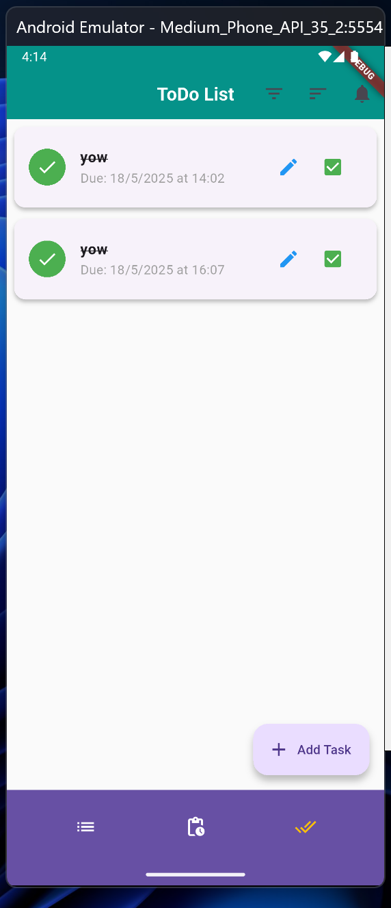

# ToDo App with Firebase and Notifications

A modern, feature-rich task management application built with Flutter that uses Firebase for data storage and Awesome Notifications for task reminders.

| **Name**               | **NRP**    |
| ---------------------- | ---------- |
| Reynaldi Neo Ramadhani | 5025221265 |

## Features

-   **Task Management**

    -   Create, read, update and delete tasks
    -   Mark tasks as completed or pending
    -   Due date and time selection for tasks
    -   Swipe-to-delete with undo functionality

-   **Smart Organization**

    -   Filter tasks by status (all, pending, completed)
    -   Sort tasks by due date or title
    -   Visual indicators for task status (pending, completed, overdue)
    -   Days remaining/overdue counter

-   **Notification System**

    -   Automatic reminders for upcoming tasks
    -   Reschedule notifications for existing tasks
    -   Background notifications even when app is closed

<details>
  <summary>The notification may have delay tolerance for 600000ms as shown in log image below</summary>


</details>

## Screenshots

|             All Tasks             |           Notification            |               Completed Task                |
| :-------------------------------: | :-------------------------------: | :-----------------------------------------: |
|  |  |  |

|               Pending Task               |              Delete Task               |                 Detail/Edit Task                 |
| :--------------------------------------: | :------------------------------------: | :----------------------------------------------: |
|  |  |  |

## Technology Stack

-   **Frontend**: Flutter/Dart
-   **Backend**: Firebase Firestore
-   **Notifications**: Awesome Notifications
-   **State Management**: Direct Stream-based approach

## Getting Started

### Prerequisites

-   Flutter SDK (latest version recommended)
-   Firebase account
-   Android Studio / VS Code with Flutter extensions

## Development Guide

### Prerequisites for Development

Make sure you have the following tools installed:

-   Flutter SDK (latest version recommended)
-   Dart SDK
-   Android Studio / VS Code with Flutter extensions
-   Firebase CLI (for deployment and configuration)
-   Git version control

### Setting Up Development Environment

1. Fork and clone this repository

```bash
git clone https://github.com/reynaldineo/todo_app_firebase_notification.git
cd todo_app_firebase_notification
```

2. Install dependencies

```bash
flutter pub get
```

3. Configure Firebase

```bash
# Install Firebase CLI if not already installed
npm install -g firebase-tools

# Login to Firebase
firebase login

# Initialize project
firebase init
```

4. Update Firebase configuration

    - Replace the `firebase_options.dart` file with your own configuration
    - Ensure Firestore rules are properly set up for your application

5. Run the app in development mode

```bash
flutter run
```

### Building for Production

To create a release build for Android:

```bash
flutter build apk --release
```

## App Architecture

The application follows a simple clean architecture pattern:

-   **Models**: Data classes that represent tasks
-   **Services**: Firebase services for CRUD operations
-   **Screens**: UI components and business logic
-   **Utils**: Helper functions for notifications, etc.

### Project Structure

```

lib/
├── firebase_options.dart # Firebase configuration
├── main.dart # App entry point and notification setup
├── models/
│ └── task_model.dart # Task data model
├── screens/
│ ├── add_task_screen.dart # Create new tasks
│ ├── edit_task_screen.dart # Edit existing tasks
│ ├── home_screen.dart # Main screen with task list
│ └── task_detail_screen_new.dart # Task details view
├── services/
│ └── task_service.dart # Firebase Firestore operations
└── utils/
└── notification_helper.dart # Notification scheduling functions

```

## References

-   [Firebase Documentation](https://firebase.google.com/docs)
-   [Awesome Notification Documentation](https://pub.dev/packages/awesome_notifications)
-   [Chat GPT](https://chatgpt.com/)

## License

This project is licensed under the [MIT License](LICENSE).
